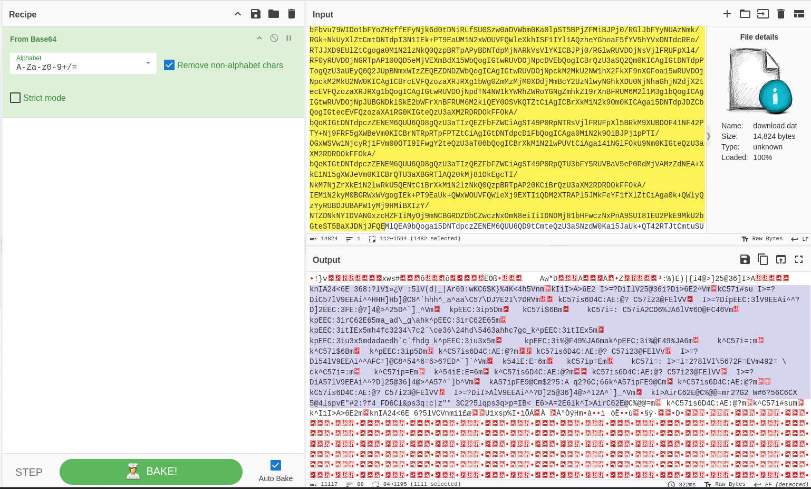
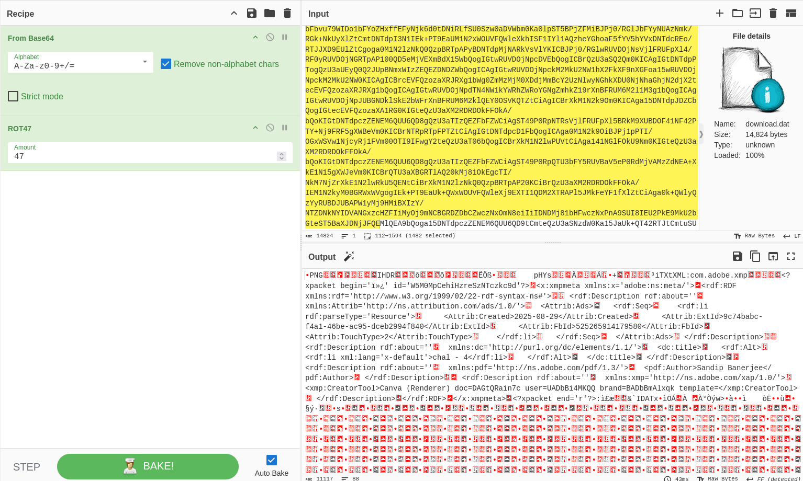

Category : forensics
Difficulty : easy - 50 points
___
First we are greeted with a nice DAT file :
	`download.dat: ASCII text, with very long lines, with no line terminators`

We open it in Cyberchef and spot an equal sign at the end : base64 !

Then we have something quite unreadable... But we notice this :

There are patterns in it... Intriging, isn't it ?
After some thinking, I came to the conclusion that those patterns would be *headers* of a file, especially an *encoded* file. Since we can still "read" it, I supposed it would be again ROT47 encoding and I was right !

Cyberchef detects a PNG file :D , let's download and analyse it !

Well the flag is directly in the image so a quick OCR with `tesseract` give us the flag.

Flag : `BLUEARENA{h3r3_1_4m_f1n6_m3}`
