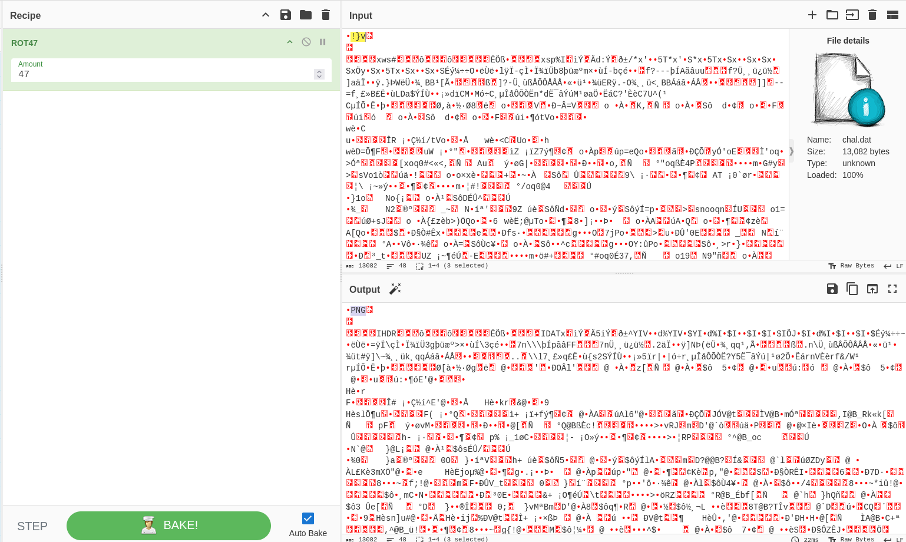
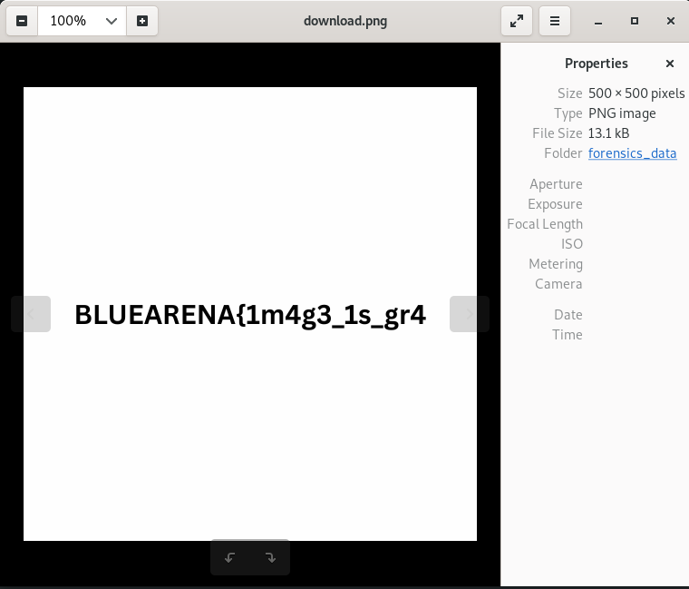
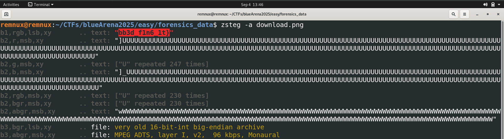

Category : forensics
Difficulty : easy - 60 points
___
First thing first ! We are pleased with a very nice file containing lots of information :
	`chal.dat: data`

...
Well, we quickly see that this file does not contain ASCII text. Let's open it in Cyberchef and begin our investigation.

Since it was my third challenge (I previously did MLE and Forensic 1), my first action was cooking some ROT47. 

Nice, a PNG file again. But something is missing...

Where is the other part of the flag ? :(

Since it is a PNG file, we might want to try a steg command :D
zsteg will do the job for us !

BINGO we now have our two parts.

Flag : `BLUEARENA{1m4g3_1s_gr4bb3d_f1n6_1t}`
