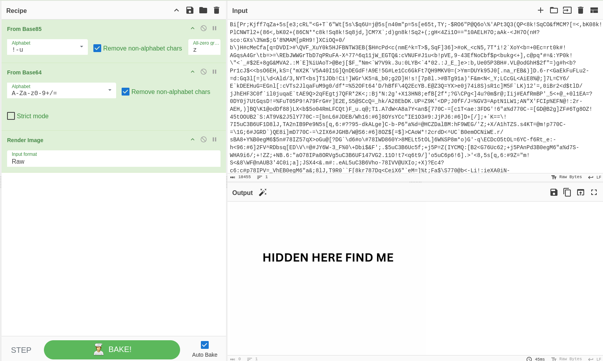

Category : forensics
Difficulty : easy - 100 points
___
We have a PNG file, or so I thought :
	`evedence.png: data`

And yes, we have some weird Magic Number here :(

Let's manually change that by running this command `( printf '\x89PNG\r\n\x1a\n'; tail -c +9 evedence.png ) > fixed.png`. Now we have a real PNG file named `fixed.png` where we'll be getting to work !

WTF is this :D ?

I lost at least one loooong hour trying to understang what was that. I tried many things such as searching manually for hints inside the image's data, then putting this long string (but without the `2`) in Cyberchef and tried many encoding format ; nothing valuable came out. What did I miss ? Sometimes hints lie in front of us... Hints *bigger* than other... Just why is that number `2` bigger than the rest of the characters ? It's not even aligned with them. Is it a *key* for something ?
I eventually remembered it was an *easy* challenge, and also that XOR fucking exists.

Bruh

YES I have someting :D
BUT... The link like this did not work... Why ? Because a `-` was missing between `ip` and `167` ! I litteraly slept a *very* good night before figuring out this. And you must wonder how I figured it out ? Hehehe... Well in another challenge was a certain URL with almost the same name... 

Here is the page you requested :

And the search goes on...

By reading the source code we find a very interesting comment.

Maybe the end is near ???

Yes of course... Keep dreaming little boy.

But I'll never give up ! We copy this thing a paste it directly in Cyberchef like a doctor treats his wounded patient, we magically (yes, by using the `Magic` mode obviously) recover something !

HA. HA. HA.
Download the fucking image.
Name it nicely.
Analyse it.

Again... ? Magic will be our salvation.

FINALLY WE HAVE SOMETHING
But I don't see any `BLUEARENA{}` thing ? Without caring at all I just put the output in the `{}` and the flag worked :D

Flag : `BLUEARENA{1m3g3_1s_3nc0d3d_h3r3_4n6_y0u_h4v3_t0_f1n6}`
