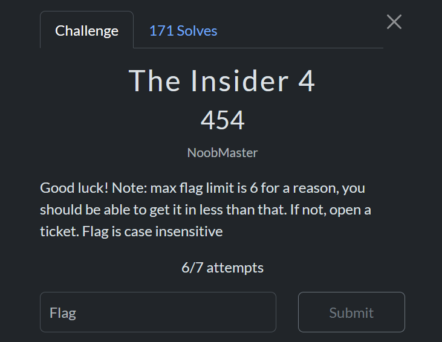

# Insider 1

The first thing to do was to go see the support team at this address:  
- https://play.scriptsorcerers.xyz/support

Then you had to check the Discord bio of one of the support members:  

Flag: `scriptCTF{1ts_0bv10u5ly_j0hn_d03_aka_n00bm4573r}`

___
# Insider 2

Not done, but here’s someone else’s write-up:  
- https://github.com/0xt4req/ScriptCTF-writeup/tree/main/OSINT

___
# Insider 3

After discovering who leaked as well as his GitHub account, you could see that he had committed other things on another GitHub account:  

By following the link to this other account, we find the 3rd flag in our series!  

Flag: `scriptCTF{2026_fl4g_f0und_1n_2025}`

___
# Insider 4

We arrive at the last step of our journey!  

We find information about the last GitHub account discovered:  

In the same `attachments` folder, we find two photos and a secret file containing this:  
`as a photographer, i add comments/descriptions to my images`

First image: `fireworks.jpg`  

Second image: `room.jpg`  

<<<<<<< Updated upstream
Premièrement, la recherche inversée d'image ne donne rien. Il ne nous reste donc plus qu'à exploiter le petit secret !
=======
First, reverse image search gives nothing. All we have left is to exploit the little secret!  
>>>>>>> Stashed changes

For that, we’re going to use the `exiftool` tool:  

Bingo! The `fireworks.jpg` photo does contain a comment!  

Clicking on the Facebook link, we land on this page:  

We then see the event’s website. Going there, we can see this:  

Knowing we’re looking for a hotel, we click on `Where to Eat, Stay, & Watch` then scroll down to `Where to STAY`. We observe two places:  
- Key Allegro, Real Estate Company  
- The INN at Fulton Harbor  

<<<<<<< Updated upstream
Ces deux lieux vont nous aider dans notre recherche, surtout le premier.
Si nous revenons sur nos pas, nous n'avons utilisé qu'une seule des deux photos du challenge : `firework.jpg`. Mais maintenant qu'on sait où chercher, la photo `room.jpg` va grandement nous guider pour trouver l'hôtel et la chambre !

Premièrement, on observe la forme de l'hôtel : en forme de `U`, avec un parking devant et quelques tables de picnic. On observe également une terre séparée par de l'eau.
La seule zone qui peut correspondre est celle-ci :
=======
These two places help our search, especially the first one.  
If we go back, we’ve only used one of the two challenge photos: `firework.jpg`. But now that we know where to search, the `room.jpg` photo will guide us a lot in this search!  

First, we observe the shape of the hotel: U-shaped, with a parking lot in front and some picnic tables. We also see land separated by water!  
The only area that matches is this one:  
>>>>>>> Stashed changes

We do indeed find *Key Allegro*. With a Google Maps search of hotels facing the bay, we just need to check which hotel matches our `room.jpg` description.  

We very quickly end up at this spot:  

To visualize the view, here’s the maps link: https://www.google.com/maps/@28.0315856,-97.0462669,3a,34.3y,256.27h,87.31t/data=!3m7!1e1!3m5!1scf74P7wpw6ffASoGftMhew!2e0!6shttps:%2F%2Fstreetviewpixels-pa.googleapis.com%2Fv1%2Fthumbnail%3Fcb_client%3Dmaps_sv.tactile%26w%3D900%26h%3D600%26pitch%3D2.6903063287553834%26panoid%3Dcf74P7wpw6ffASoGftMhew%26yaw%3D256.27150613110496!7i16384!8i8192?hl=fr&entry=ttu&g_ep=EgoyMDI1MDgxMy4wIKXMDSoASAFQAw%3D%3D  

We then retrieve the hotel address: `901 Hwy 35 N, Rockport, TX 78382, United States`  

Thus we have the first part of the flag!  
- `scriptCTF{901_Hwy_35_N_`  

<<<<<<< Updated upstream
Maintenant, on va se pencher sur le numéro de la chambre. La première observation se fait sur le lien maps juste au dessus : 
- on ne voit pas les numéros de chambres de cet emplacement, il faudra donc aller de l'autre côté, juste ici : https://www.google.com/maps/@28.031457,-97.047378,3a,75y,69.91h,75.94t/data=!3m7!1e1!3m5!1s7RXlB_db0szyw8-FjaD_lA!2e0!6shttps:%2F%2Fstreetviewpixels-pa.googleapis.com%2Fv1%2Fthumbnail%3Fcb_client%3Dmaps_sv.tactile%26w%3D900%26h%3D600%26pitch%3D14.058045464968231%26panoid%3D7RXlB_db0szyw8-FjaD_lA%26yaw%3D69.91178046392373!7i16384!8i8192?hl=fr&entry=ttu&g_ep=EgoyMDI1MDgxMy4wIKXMDSoASAFQAw%3D%3D
=======
Now, let’s focus on the room number. The first observation comes from the maps link above:  
- we don’t see the room numbers from this spot, so we have to go to the other side, right here: https://www.google.com/maps/@28.031457,-97.047378,3a,75y,69.91h,75.94t/data=!3m7!1e1!3m5!1s7RXlB_db0szyw8-FjaD_lA!2e0!6shttps:%2F%2Fstreetviewpixels-pa.googleapis.com%2Fv1%2Fthumbnail%3Fcb_client%3Dmaps_sv.tactile%26w%3D900%26h%3D600%26pitch%3D14.058045464968231%26panoid%3D7RXlB_db0szyw8-FjaD_lA%26yaw%3D69.91178046392373!7i16384!8i8192?hl=fr&entry=ttu&g_ep=EgoyMDI1MDgxMy4wIKXMDSoASAFQAw%3D%3D  
>>>>>>> Stashed changes

Then in the `room.jpg` photo, we observe:  
- the room is on the ground floor  
- it is aligned with the third parking spot from the left, so it’s well to the left but not all the way at the end  

Finally, in the last maps link, when zooming in on the room all the way to the right, we can see this:  

Looking closely, we can read the number `107`.  
But that’s not all, two rooms to the left we find `109`!  
Thus, the further left we go, the higher the number. Now that we know each door equals one room, we count left to leave only numbers between `111` and `114`, since our room is to the left.  

All that’s left is to try each combination with a different room number ;)  

Flag: `scriptCTF{901_Hwy_35_N_111}`
